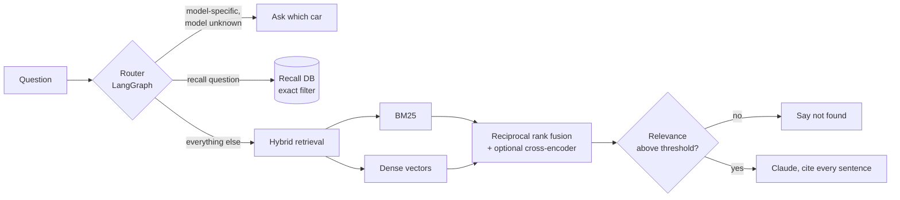

# Norvik after-sales assistant

A retrieval-augmented assistant for car dealers and owners. It answers service and warranty questions from manuals with a source on every sentence, looks up recall campaigns from a structured database, asks which car you mean when the answer depends on it, and says "I couldn't find that" instead of guessing.

The same tools are exposed over MCP, so Claude Desktop or any other MCP client can use them directly.

```
$ curl -X POST localhost:8000/ask -H 'content-type: application/json' \
    -d '{"question": "Is it safe to keep driving my Aster with a yellow hybrid warning?"}'

{
  "answer": "A yellow hybrid system warning means the car can still be driven but should be
             inspected within 7 days. [1] A red hybrid system warning means stop safely as soon
             as possible, switch off, and call Norvik Roadside Assistance. [1]",
  "route": "manuals",
  "model": "Aster Hybrid",
  "citations": ["[1] Norvik Aster Hybrid Service Manual (2022-2024) > Hybrid system warning light"],
  "abstained": false
}
```

> Norvik Motors and its manuals are made up. The corpus is synthetic so the repo can be public and every eval answer is checkable. `scripts/fetch_nhtsa_recalls.py` pulls real recall data from the NHTSA API if you want to swap it in.

## How it works



The router is a small LangGraph graph with three branches. Recall questions go to a JSON database filtered by model and year, because a recall is an exact record: you want "is my 2023 car affected", not "passages that sound like recalls". Questions like "what tyre pressure should I use?" have a different answer per model, so if no model is named the assistant asks instead of picking one.

Manual questions go through hybrid retrieval. BM25 catches exact tokens that embeddings blur, such as `P0A80`, `CHG-07` or `0W-20`. Dense vectors catch paraphrases. The two rankings are merged with reciprocal rank fusion, and a cross-encoder reranker can be switched on with one environment variable. When the question names a model, chunks from the other model's manual are filtered out before ranking.

Before generating, the top hit's relevance (query term coverage plus cosine similarity) is checked against a threshold. Below it, the assistant refuses. Above it, Claude gets numbered sources and a system prompt that requires a citation on every factual sentence and puts safety instructions first.

## Evaluation

`python eval/run_eval.py` runs three labelled sets and CI fails if the numbers drop below the thresholds in `tests/test_eval_thresholds.py`.

<!-- results from eval/results.md -->
Embedder: `hashing`, reranker: `none`

| Retrieval mode | Questions | Hit@1 | Hit@3 | MRR |
|---|---|---|---|---|
| bm25 | 31 | 0.97 | 1.00 | 0.98 |
| dense | 31 | 0.94 | 0.97 | 0.96 |
| hybrid | 31 | 0.97 | 1.00 | 0.98 |

Abstention accuracy (answer vs. say "not found"): **0.94** on 16 questions
Routing accuracy (manuals / recalls / clarify): **1.00** on 10 questions

Read these with the corpus size in mind. Four documents and 22 sections is a small haystack, so high hit rates are expected. The set is there to catch regressions when chunking, filtering or fusion changes, not to prove the system works at scale.

Where it still fails:

- Dense-only retrieval ranks the spark plug question fifth. The default embedder is character n-gram hashing, which runs offline but understands nothing. Switching to `sentence-transformers` is the first thing to try.
- "What is the towing capacity of a pickup truck?" gets answered when it should be refused, because "capacity" overlaps with the battery warranty text. Term-coverage relevance is a blunt instrument. A reranker score or an LLM relevance check would handle it better.
- BM25 misses "can Norvik help?" for the goodwill section on the first try, since the section never says "help".

## Run it

```bash
git clone <this repo> && cd aftersales-rag
python -m venv .venv && source .venv/bin/activate
make install          # pip install -e ".[dev,ui]"
cp .env.example .env  # add ANTHROPIC_API_KEY to use Claude
make test
make api              # http://localhost:8000/docs
make ui               # Streamlit chat, in a second terminal
```

With no API key the assistant falls back to extractive answers (the best-matching sentences, still cited), which is also what the tests use. For real semantic search:

```bash
pip install -e ".[semantic]"
EMBEDDER=sentence-transformers RERANKER_MODEL=cross-encoder/ms-marco-MiniLM-L-6-v2 make eval
```

Docker: `make docker`.

### Use it from Claude Desktop

Add this to `claude_desktop_config.json`:

```json
{
  "mcpServers": {
    "norvik-aftersales": {
      "command": "/path/to/aftersales-rag/.venv/bin/aftersales-mcp"
    }
  }
}
```

The server exposes `search_service_docs`, `check_recalls` and `ask_assistant`.

## Layout

```
src/aftersales_rag/
  ingest.py        front matter parsing, section-aware chunking with overlap
  embeddings.py    offline hashing embedder, sentence-transformers backend
  retrieval.py     BM25 + dense + RRF, model filter, optional reranker
  recalls.py       structured recall lookup
  generation.py    Claude with citations, extractive fallback, abstention
  agent.py         LangGraph router and nodes
  api.py           FastAPI
  mcp_server.py    MCP server
eval/              labelled question sets and the eval runner
data/              synthetic manuals, warranty policy, schedule, recalls
app/               Streamlit UI
scripts/           NHTSA recall importer
```

## Design choices

Recalls are not embedded. They are few, structured and need exact filtering by model year, and a vector search would happily return a 2025 recall for a 2022 car.

Refusing is treated as a feature and measured. For after-sales, a confident wrong torque spec or coolant type is worse than no answer, so the abstention set has as many unanswerable questions as answerable ones.

The offline embedder exists so CI needs no model downloads and no API key. It is a baseline, and the eval shows its weakness honestly rather than hiding it behind a bigger model.

## Next steps

- LLM-as-judge faithfulness scoring on generated answers, run only when a key is present
- Ingest PDFs with table extraction, since real manuals keep specs in tables
- Conversation memory so "and for the Tern?" works as a follow-up
- Swap the JSON recall file for Postgres and add a VIN decoder

MIT licensed.
